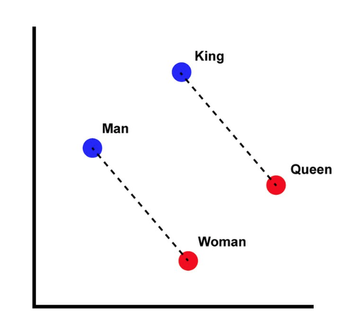
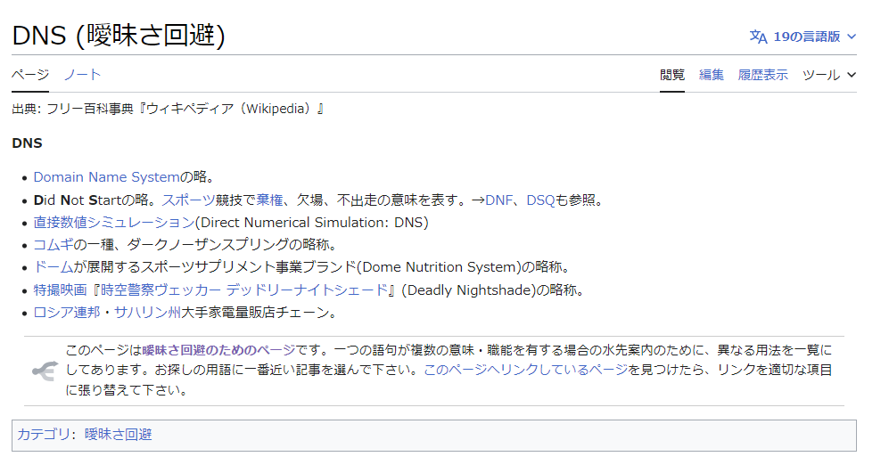
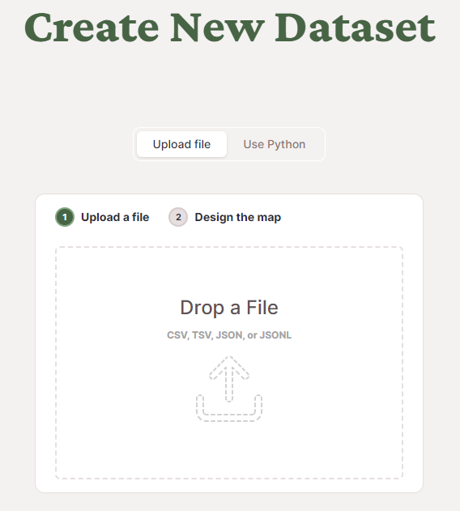
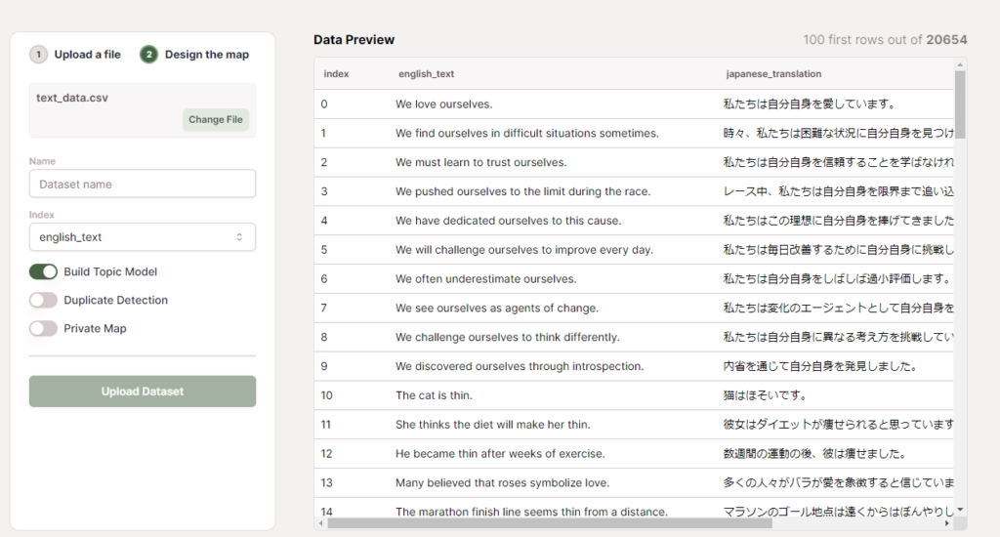
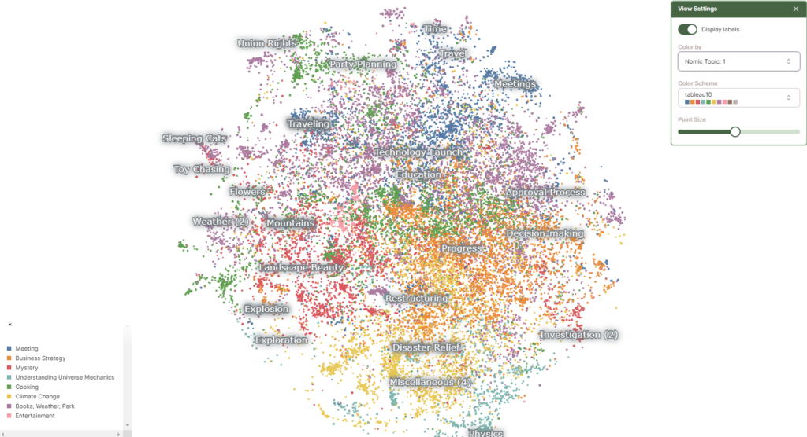
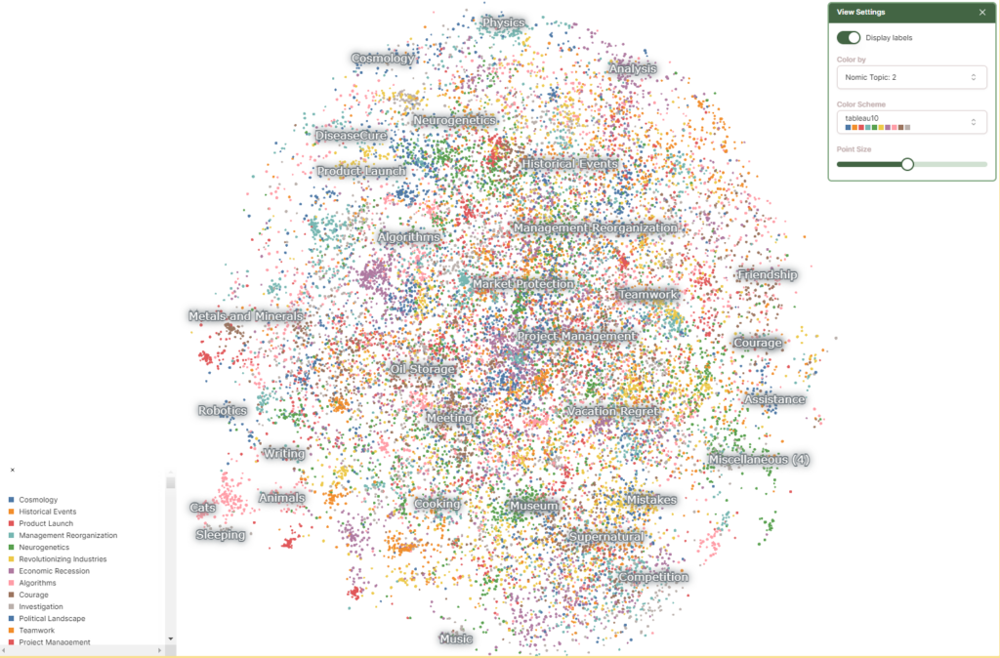
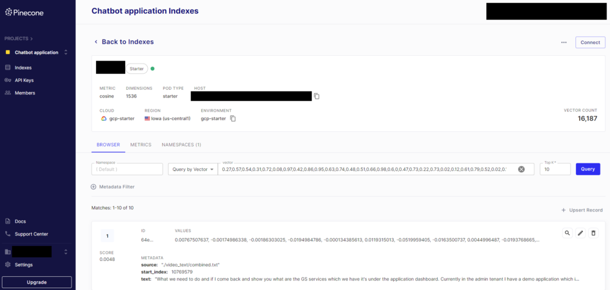
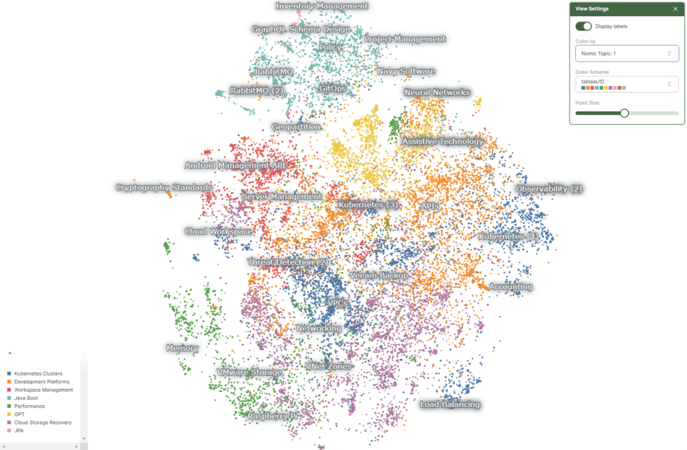
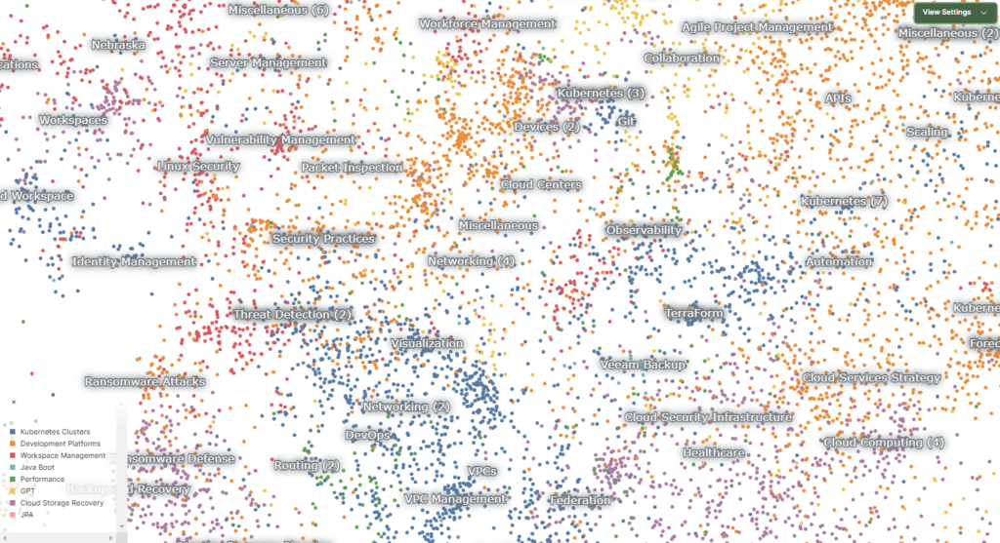
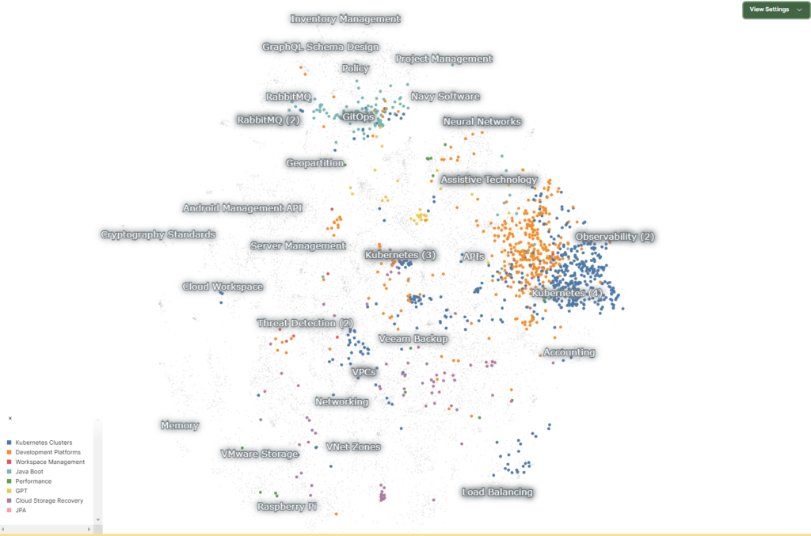

埋め込み（Embeddings）は画像やテキストなどのデータを高次元のベクトルデータに変換し、機械学習などのユースケースに適用するための手法です。例えばテキストの場合、「ありがとう」と「感謝します」という言葉は意味的に似ていますが、単純な正規表現などの文字列を直接扱う手法では、意味的にどれだけ似ているか？ということを計算することは難しいです。無理やりやるとすれば、ありがとうに対応する類似した単語を事前に大量にデータベースとして登録しておく、などが考えられますが、データ量の発散を想像するだけで恐ろしいです。

そこで、**埋め込み（Embeddings）という、テキストや画像などの非構造データをコンピュータが扱いやすいように数値として変換してあげる手法があります。**例えば「ありがとう」は (0.1, 0,1, 0.8) 、「感謝します」は (0.1, 0,1, 0.7) といった感じです。両方のベクトルデータの「近さ」をコサイン類似度などで計算してあげることで、2 つのテキストがどれだけ似ているかが分かるというわけです。

<figure>



<figcaption>

Man, Woman, King, Queen の埋め込みによる意味的類似性のマッピング  
[https://en.wikipedia.org/wiki/Word2vec](https://en.wikipedia.org/wiki/Word2vec)

</figcaption>

</figure>

最近だと埋め込みはRAG を活用したチャットボットのユースケースに使われます。ベクトルデータとして社内のドキュメントなどをデータベースに保存しておき、ユーザーが自然言語で問い合わせるとそれに近しいベクトルデータを検索し、それをもとに回答を検索する、といったような、より高度なチャットボットといった感じです。

ここでの課題の1つとして、**埋め込みされたベクトルデータはコンピュータにとっては扱いやすいものの、人間にとっては扱いにくいということです。**ベクトル化される前の生のデータの方が人間にとっては見やすいですが、とりわけ非構造データの場合は、スポットでの分析になりがちで、データの全体感を把握することが結構難しいです（ログ解析をイメージしてください）。構造化されたデータであれば主成分分析やクラスタリングなどの手法が考えられます。

前置きが長くなりましたが、今回紹介するNomic Atlas はこのようなベクトル化された非構造データの可視化に適したサービスになります。なお、以降はテキストのみを対象とします。

## 埋め込みモデルのトレンド

埋め込みモデルにはいろいろありますが、2024/2/6 現在よく使われるものとしてOpenAI のtext-embedding-ada-002 があります。有償ですが、OpenAI API と組み合わせる際には本家本元の埋め込みを使った方が（何も考えなくてよかったので）楽でした。ただ、最近は**text-embedding-3-small とtext-embedding-3-large というtext-embedding-ada-002 にとって代わる新しい埋め込みモデルが出てきたので、今後はtext-embedding-ada-002 は使われなくなってくると思います。**

[https://openai.com/blog/new-embedding-models-and-api-updates](https://platform.openai.com/docs/guides/embeddings/embedding-models)

[](https://blog.vpantry.net/wp-content/uploads/2024/02/image.png)

**多言語対応となると話は変わります。**特に我々日本人にとっては、日本語データに対応した良い埋め込みモデルが欲しいケースがあります。上記のtext-embedding-ada-002 などでもベクトル化は可能ですが、「多言語対応しています」「日本語のデータを集中的に使って学習させました」と言われた方が安心ですし、ベクトル化したその先の精度面の確保にて、使った埋め込みモデルが問題になるケースもあるかと思います（なお、このあたりの議論は[OpenAI API コミュニティ](https://community.openai.com/t/openai-embeddings-multi-language/557710)でもしばしばスレッドが立っているので一読してみると面白いです）。

下記資料は、オープンかつ日本語に特化した埋め込みモデルに関するもので、非常によくまとまっていて勉強になりました。一言でまとめると、結局のところ無料で日本語のText Embedding したい場合は、[multilingual-e5](https://huggingface.co/intfloat/multilingual-e5-large) だよね、という結論です。

https://speakerdeck.com/nttcom/exploring-publicly-available-japanese-embedding-models

実は今回紹介するNomic Atlas をリリースしているNomic 社も、[nomic-embed-text-v1](https://huggingface.co/nomic-ai/nomic-embed-text-v1) という埋め込みモデルを出しています（というか実はこっちがきっかけでAtlas を調べてました）。無料でオープン、しかも一部ベンチマークではtext-embedding-3-small を上回るパフォーマンスということです。

ここまで様々な埋め込みモデルを紹介しましたが、どのモデルを選べばいいか迷います。直近はtext-embedding-3-small とnomic-embed-text-v1 を試しつつ、日本語だったらmultilingual-e5-large を使っていこう、というのが私が出した結論になりますが、ベンチマークや価格、モデルサイズ、透明性以外の判断材料として、**Nomic Atlas で埋め込みの結果を可視化して比較してみる**、ということもできます。**これがめっちゃ面白いです。**

[https://blog.nomic.ai/posts/nomic-embed-text-v1](https://blog.nomic.ai/posts/nomic-embed-text-v1)

上記Nomic のブログの中に、Atlas によるnomic-embed-text-v1 とtext-embedding-ada-002 それぞれでWikipedia ページを埋め込みした結果の可視化の比較があります。ベクトル化したデータをAtlas によりさらに二次元に落とし込むことで、埋め込みしたデータポイントの比較が可能となります。

[](https://blog.vpantry.net/wp-content/uploads/2024/02/nomic.gif)

ここから、人間によるデータの解釈が必要になります。主成分分析と同様、先にデータのかたまりに注目して、その後に個別のポイントを見ていく流れが良いと思います。

散布図右下にあるデータ群は、Nomic Embed では曖昧さ回避ページの群になります（ここには出ていませんが、実際にAtlas を使うと自動的なラベリングもできるので幾分か解釈しやすいです）。ちなみに曖昧さ回避ページとは↓のようなものです。

[](https://blog.vpantry.net/wp-content/uploads/2024/02/image-3.png)

次のGif を見ると、Nomic Embed では曖昧さ回避ページがきちんと右下にグルーピングされているのに対し、Ada ではいくつかのかたまりはあれどNomic Embed よりもばらけていることが分かります。この意味では、Nomic Embed の方が曖昧さ回避ページに限って言えば、Ada よりもうまくクラスタリングできていると言えます。

[](https://blog.vpantry.net/wp-content/uploads/2024/02/nomic-refer.gif)

ある程度データの偏りがコントロールできているデータセットを用意できれば、このようなAtlas による二次元散布図への可視化によって、埋め込みモデルの性能を定性的に判断できそうです。

## Atlas でテキスト埋め込みを可視化してみよう

前置きが長くなりましたが（2回目）、ようやく本題です。Nomic Atlas でテキスト埋め込みを可視化してみます。残念ながら私が使ったデータセットを公開することはできないのですが、英語と日本語訳に対応した約2万のデータセットと、2023 年の[VM Explore US](https://www.vmware.com/explore/video-library/search.html#year=2023) の公開されている録画データ内の音声をすべてテキストにまとめたものが手元にあるので、これを使います。なお、前者に関しては生成AI でデータセットを作り、後者は[Assembly AI](https://www.assemblyai.com/) というサービスを使いました（前者のデータセット作成については後日ブログにまとめると思います）。

### ブラウザ版での利用

まずは会員登録をします。制限はありますが、基本的な機能は無料で利用できます。

[https://atlas.nomic.ai/](https://atlas.nomic.ai/)

無料版では、可視化できるデータポイントの数などに制限はありますが、**可視化したデータが必ず外部公開されてしまうという点が一番大きな制限です。**直近課金体系等に変更があるみたいで、この部分は個人的に何とかしてほしいですが、2024/2/6 現時点では、個人情報等のセンシティブなデータセットを無料版のStarter Plan で可視化しないよう注意してください。

会員登録が完了したら、ブラウザからCSV やJSON などをアップロードすることで、nomic-embed-text-v1 により自動的に埋め込みが行われ、散布図としてマッピングされます。

[](https://blog.vpantry.net/wp-content/uploads/2024/02/image-5.png)

[](https://blog.vpantry.net/wp-content/uploads/2024/02/image-4.png)

ポイントは左ペインのIndex で、ここで埋め込みをするデータ列を選択します。上記の例では英文と対応する日本語訳のデータで、英文の方をベクトル化することになります。なお、現時点で深い構造をしたJSON だとここでうまくデータが解釈されなかったので、CSV 等に変換したほうがよさげです。

可視化した結果は自動的にラベルが振られ、入力したデータのカラムごとに色分けして可視化されます。データがどの話題に沿ったものか、どういった話題が多いのか、自動的に可視化してくれる点が面白いです。裏側の実装としては、クラスタリングした後にLLM 等でラベルをつけているようです。

[https://docs.nomic.ai/atlas/how-atlas-works/about-topics](https://docs.nomic.ai/atlas/how-atlas-works/about-topics)

[](https://blog.vpantry.net/wp-content/uploads/2024/02/image-7.png)

### API を活用した他の埋め込みモデルの利用

次に、API を活用して別の埋め込みモデルを使ったデータを可視化してみます。ドキュメントは下記のとおりですが、現時点ではかなり記載が不足しているので、解説をしながら進めていきます。なお、プログラミング言語はPython を使います。

[https://docs.nomic.ai/](https://docs.nomic.ai/)

大まかな流れとしては単純で、埋め込みモデルを使って得られたnumpy.ndarray 型のベクトルデータをatlas.map\_data() 関数に入れるだけです。

まずはnomic パッケージをインストールします。

```bash
pip install --upgrade nomic
```

パッケージをインポートし、API キーを環境変数等から読み出します。API キーはAtlas のサイトから取得できます。

```python
from nomic import atlas
import nomic

nomic.login("YOUR_NOMIC_API_KEY")
```

今回はmultilingual-e5-large による埋め込みを入力に使います。

```bash
pip install -U sentence-transformers
```

```python
from sentence_transformers import SentenceTransformer
model = SentenceTransformer('intfloat/multilingual-e5-large')
```

データを読み込みます。使ったデータは下記のような形式です。今回はこの中のjapanese\_translation カラムのデータをmultilingual-e5-large で埋め込みします。

[](https://blog.vpantry.net/wp-content/uploads/2024/02/image-8.png)

```python
import pandas as pd

df = pd.read_csv("text_data.csv")
japanese_texts = df['japanese_translation'].tolist()
english_texts = df['english_text'].tolist()
```

multilingual-e5-large のお作法として、入力するテキストに"query: "というプレフィックスをつける必要があることに注意です。

> **1\. Do I need to add the prefix "query: " and "passage: " to input texts?**
> 
> Yes, this is how the model is trained, otherwise you will see a performance degradation.
> 
> [https://huggingface.co/intfloat/multilingual-e5-large](https://huggingface.co/intfloat/multilingual-e5-large)

```python
# Preprocessing for Embeddings
japanese_texts = ["query: " + text for text in japanese_texts]
embeddings = model.encode(japanese_texts, normalize_embeddings=True)
```

Google Colab では約2万のデータに対する埋め込みで1.5 時間くらいかかりました。

埋め込みが完了したら、次に可視化のためにベクトルデータと紐づける別のデータをdict で準備します。これがないと、散布図だけの寂しい可視化になってしまいます。ここではベクトル化した日本語のデータに対して対応する英文を紐づけます。

```python
dict_list = [{'text': text} for text in english_texts]
```

dict の中身はこんな感じです。

```bash
dict_list[0:2]

[{'text': 'We love ourselves.', 'id_': 'AA'},
 {'text': 'We find ourselves in difficult situations sometimes.', 'id_': 'AQ'}]
```

あとはatlas.map\_data() を叩けば、自動的にAtlas 側にデータが送信され、可視化が可能となります。なお、topic\_model=dict(topic\_label\_field='text') 引数はラベル付けに使うデータになります。'text' は先ほどのdict のキーです。経験上、ラベル付けに使うデータは英語の方がよいです（そもそもAtlas 側で日本語ラベルを付けられない）。

```python
atlas.map_data(embeddings=embeddings, identifier="my-dataset", data=dict_list, topic_model=dict(topic_label_field='text'))
```

[](https://blog.vpantry.net/wp-content/uploads/2024/02/image-9.png)

[](https://blog.vpantry.net/wp-content/uploads/2024/02/image-10.png)

ここまでのコードをまとめます。流れは簡単だと思いますが、いかんせんドキュメントがまだまだ充実していないため、実装を追うのが結構大変です。

```python
from nomic import atlas
import nomic
import pandas as pd
from sentence_transformers import SentenceTransformer

nomic.login("YOUR_NOMIC_API_KEY")

# Load embeddings model
model = SentenceTransformer('intfloat/multilingual-e5-large')

df = pd.read_csv("text_data.csv")
japanese_texts = df['japanese_translation'].tolist()
english_texts = df['english_text'].tolist()

# Preprocessing for Embeddings
japanese_texts = ["query: " + text for text in japanese_texts]
embeddings = model.encode(japanese_texts, normalize_embeddings=True)

dict_list = [{'text': text} for text in english_texts]
atlas.map_data(embeddings=embeddings, identifier="my-dataset", data=dict_list, topic_model=dict(topic_label_field='text'))
```

### ベクトルDB に格納したデータの可視化

同様の手順で、ベクトルDB に保存されているデータもAtlas で可視化できます。手順としては同じ流れで、つまりベクトルDB のデータを取得し、numpy.ndarray 型にして、atlas.map\_data() を叩きます。

今回はPinecone DB に格納してあるデータを使います。事前に2023 年のVM Explore の録画データ内の音声をAssembly AI でテキスト化しtext-embedding-ada-002 でベクトル化して保存しています。

[](https://blog.vpantry.net/wp-content/uploads/2024/02/pinecone.png)

pinecone-client パッケージをインストール後、下記コードを実行します。

```bash
pip install pinecone-client nomic
```

```python
from pinecone import Pinecone
import numpy as np
from nomic import atlas
import nomic

pc = Pinecone(
    api_key="YOUR_PINECONE_API_KEY"
)
nomic.login("YOUR_NOMIC_API_KEY")

# 最大1万のレコードのID を取得
def get_ids_from_query(index, input_vector):
    print("searching pinecone...")
    results = index.query(vector=input_vector,
                          top_k=10000, include_values=False)
    ids = set()
    print(type(results))
    for result in results['matches']:
        ids.add(result['id'])
    return ids

# すべてのレコードのID を取得
def get_all_ids_from_index(index, num_dimensions, namespace=""):
    num_vectors = index.describe_index_stats()["total_vector_count"]
    all_ids = set()
    while len(all_ids) < num_vectors:
        print("Length of ids list is shorter than the number of total vectors...")
        input_vector = np.random.rand(num_dimensions).tolist()
        print("creating random vector...")
        ids = get_ids_from_query(index, input_vector)
        print("getting ids from a vector query...")
        all_ids.update(ids)
        print("updating ids set...")
        print(f"Collected {len(all_ids)} ids out of {num_vectors}.")

    return all_ids

# ID を1000ごとにバッチに分けてDB から繰り返しfetch
def fetch_in_batches(all_ids, batch_size=1000):
    ids = []
    texts = []
    embeddings = []

    for i in range(0, len(all_ids), batch_size):
        batch_ids = all_ids[i:i + batch_size]
        vectors = index.fetch(batch_ids)
        for id, vector in vectors['vectors'].items():
            ids.append(id)
            texts.append(vector["metadata"]["text"])
            embeddings.append(vector['values'])

    return ids, texts, np.array(embeddings)

# Pinecone DB のインデックス名を入力
index = pc.Index("YOUR_INDEX_NAME")
# データを取得するためのID を取得
all_ids = get_all_ids_from_index(index, num_dimensions=1536, namespace="")
# ID、text、ベクトルデータを取得
ids, texts, embeddings = fetch_in_batches(list(all_ids))

dict_list = [{'text': text} for text in texts]
atlas.map_data(embeddings=embeddings, identifier="pinecone-dataset", data=dict_list, topic_model=dict(topic_label_field='text'))
```

上記コードのポイントとして、現在のPinecone Client の仕様として、DB からすべてのベクトルデータを取得するには一工夫が必要です。データの取得のためのindex.fetch() 関数の引数には各データが持つID が必要なのですが、このID をpython client から直接取得することはできません。

[https://docs.pinecone.io/docs/fetch-data](https://docs.pinecone.io/docs/fetch-data)

そこで、fetch の前に同じ次元を持つ任意のベクトルを使って近傍検索を繰り返し、似ているベクトルを現在Pinecone Client が対応しているtop\_k の最大値10000 個のベクトルを取得し（10000 も似ているベクトルが欲しいわけではなく、単にすべてのベクトルのリストが欲しいだけ）、それと同時に取得できる各ベクトルのID を取得を繰り返す、というかなりの荒業を使います。それがget\_ids\_from\_query() とget\_all\_ids\_from\_index() 関数です。

また、取得したデータのID のリストのサイズが大きいと、Pinecone DB から一度にfetch できるデータ量には制限があるため、fetch\_in\_batches() でバッチに分けてfetch しています。

可視化の結果は以下のようになりました。

[](https://blog.vpantry.net/wp-content/uploads/2024/02/image-11.png)

「どのラベルが目立つか」についてはデータ量とはあまり関係がないようで、例えばセッション数としてはそれほど多くないVeeam Backup のラベルが目立っています。なお、グラフをズームすると、もっとたくさんのラベルが出てきます。

[](https://blog.vpantry.net/wp-content/uploads/2024/02/image-12.png)

2023 年のVM Explore US では、どのような話題が豊富だったかが可視化できています。ここで、Kubernetes に絞って見てみると、以下のようになりました。

[](https://blog.vpantry.net/wp-content/uploads/2024/02/image-13.png)

右側に青とオレンジの群があり、上部には緑（？）色のデータが固まっています。ラベルを見ると、青はKubernetes Cluster、オレンジはDevelopment Platforms、緑はJava Boot （Spring と混じったっぽい）のラベルがあります。同じKubernetes に関するセッションですが、インフラ領域と思われる青とオレンジは右側に、開発者向けの領域と思われる緑はそれらとは離れて上側に寄るのが面白いですね。セッション数としても（厳密には点の数=セッションの数というわけではないですが）インフラ領域を得意としているVMware のイメージと整合性が取れているのではないでしょうか。

## まとめ

本記事では、Embeddings の概要からNomic Atlas によるベクトルデータの可視化、Atlas API の利用方法についてご紹介しました。無味乾燥なベクトルデータに対して、Nomic Atlas は無料の範囲内でも十分に解釈性を与えてくれます。無料プランだとデータが公開されてしまう点は使いづらいですが、例えばRAG を組む際に前もって自分が処理しているデータに対してこのような知見を得られると、いろいろ捗るのではないかなと思いました。
