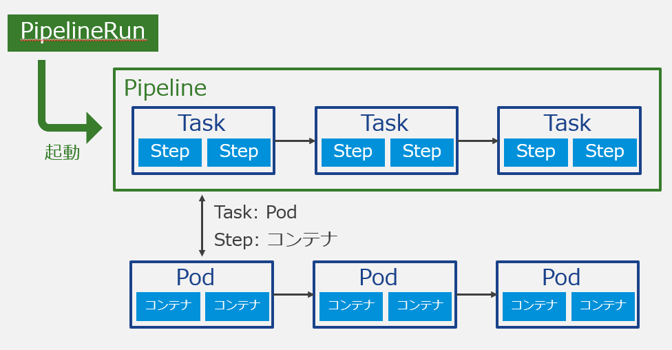
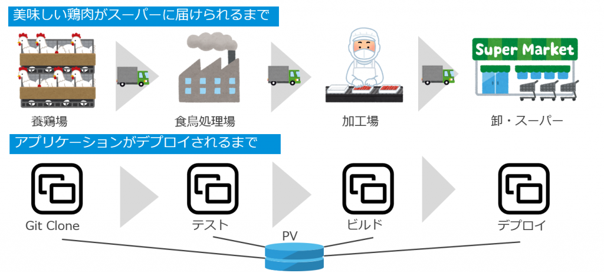

- [インフラエンジニアのためのCI/CD 入門 1](https://blog.vpantry.net/2021/01/cicd-1/)
- [インフラエンジニアのためのCI/CD 入門 2](https://blog.vpantry.net/2021/01/cicd-2/)
- [インフラエンジニアのためのCI/CD 入門 3](https://blog.vpantry.net/?p=845)

前回はGitOps の考え方に触れ、CI/CD パイプラインの構成の仕方と、構築予定のパイプラインの各タスクを整理した。今回はパイプラインを構築するためのツールであるTekton を紹介しよう。

### Tekton とは

Tekton はパイプライン作成のためのOSS であり、Kubernetes を前提として作られているのが特徴だ。それゆえに、パイプラインを構成するファイルはKubernetes のマニフェストとして定義され、Tekton コンポーネントそれ自体もKubernetes のCustom Resource として展開される。最も重要なのは、パイプライン中のタスクはPod およびコンテナで実行される点であり、例えば前回紹介したコンテナのビルドや静的コード解析をはじめとした各テストはPod の中で実行される。

もう少し詳しく見てみよう。

Tekton でパイプラインを作るためにはKubernetes マニフェストをApply して環境にいくつかのリソースを払い出す必要があるが、おおまかに以下の3 つのリソースがある\[note\]ほかにもリソースはあるが割愛。詳細はドキュメント参照。\[/note\]。

- Task リソース  
    Step（コンテナの中で実行される各作業） の集合で実態はPod
- Pipeline リソース  
    Task（Pod）の集合で、一時的にPod をデプロイして各Task を順番に実行していく
- PipelineRun リソース  
    Pipeline を実行するためのリソース



これらの関係は実際のマニフェストを見るとより理解が深まる。

Task リソースのマニフェストの例は以下の通りである。このタスクはコンテナの中で"Hello World" を出力する。Pod のマニフェストと類似しており、使用するコンテナイメージや実行するコマンドなどを記載する。

```yaml
apiVersion: tekton.dev/v1beta1
kind: Task
metadata:
  name: echo-hello-world
spec:
  steps:
    - name: echo
      image: ubuntu
      command:
        - echo
      args:
        - "Hello World"
```

Pipeline リソースのマニフェストの例は以下の通りである。パイプラインの中に実行されるタスクが含まれるわけだから、先のTask リソースの名前が複数記載される（今回はecho-hello-world-task 1 つ）。

```yaml
apiVersion: tekton.dev/v1beta1
kind: Pipeline
metadata:
  name: echo-hello-world-pipeline
spec:
  tasks:
    - name: echo-hello-world-task
      taskRef:
        name: echo-hello-world
```

PipelineRun リソースのマニフェストの例は以下の通りである。パイプラインを実行するためのリソースであり、Pipeline リソースの名前が含まれる（echo-hello-world-pipeline）。

```yaml
apiVersion: tekton.dev/v1beta1
kind: PipelineRun
metadata:
  name: echo-hello-world-pipeline-run
spec:
  pipelineRef:
    name: echo-hello-world-pipeline
```


上のスクリーンショットのように、kubectl apply コマンドで先のマニフェストを適用していくが、ポイントはPipelineRun を適用する前にTask とPipeline リソースを適用することである。PipelineRun を適用して初めて、実際のタスクが実行され、Pod が立ち上がる。また、kubectl logs コマンドでHello World の出力がされていることを確認できる。

今回の例では単純にHello World を出力するだけのパイプラインなので、タスクとしてのPod も1つしか立ち上がらないため、タスクを繋げるパイプライン感はあまりない。実際には複数のタスクが連続して実行されるため、タスクの成果物を何らかの方法で次のタスクに渡す必要がある。例えば、1.コンテナイメージを作成し、2.イメージをデプロイするという2つのタスクがあれば、1 で作成したイメージを2 で実行されるPod に受け渡す必要がある。Tekton ではこのようなタスク間の成果物の受け渡しをPersistent Volume （PV）を使って実現しており、パイプラインではPV を介して流れ作業を実行しているイメージが近いと思う。

<figure>



<figcaption>

参考：https://0109.co.jp/sm/business/knowledge\_4.html

</figcaption>

</figure>

### Tekton のインストール

Tekton のインストールは非常に簡単だ。kubectl apply コマンドだけでインストールできる。

[https://tekton.dev/docs/getting-started/](https://tekton.dev/docs/getting-started/)

1. Tekton パイプラインのインストール  
    kubectl apply –f [https://storage.googleapis.com/tekton-releases/pipeline/latest/release.yaml](https://storage.googleapis.com/tekton-releases/pipeline/latest/release.yaml)
2. Tekton トリガーのインストール  
    kubectl apply -f [https://storage.googleapis.com/tekton-releases/triggers/latest/release.yaml](https://storage.googleapis.com/tekton-releases/triggers/latest/release.yaml)
3. Tekton ダッシュボードのインストール  
    kubectl apply -f [https://github.com/tektoncd/dashboard/releases/latest/download/tekton-dashboard-release.yaml](https://github.com/tektoncd/dashboard/releases/latest/download/tekton-dashboard-release.yaml)

このうち2 と3 はオプションであり、トリガーはその名の通りGit リポジトリのマージなどのイベントをトリガーにパイプラインの実行をするためのコンポーネント、ダッシュボードはUI を提供する。単純にパイプラインを作るだけであれば1 を実行するだけでよい。

### まとめ

今回はTekton の概要を紹介した。単純なパイプラインを作るだけであればそこまで難しくはないのだが、意味のあるタスクを組み合わせて実際にパイプラインを作成するのは非常に難しい。マニフェストを作ってつなげる作業だけで時間がかかってしまう。とはいえ、パイプラインと格闘することでより理解が深まると思うので、次回は実際にパイプラインを作ってみることにしよう。
