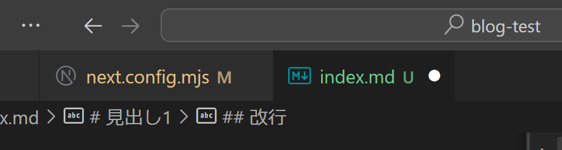

# 見出し1

## 見出し2
- test1
  - test11
  - test12
    - test111
    - test112
- test2
- test3

### 見出し3
1. aaa
   1. aaa1
   2. aaa2
      1. aaaa1
      2. aaaa2
2. 33
3. aaa

**こんにちは.**あああああああああああああああああああああああああああああああああああああああああああああああああああああああああああああああ

## 改行
aaa

aaa


https://archt.blue/articles/markdown




```bash
dict_list[0:2]

[{'text': 'We love ourselves.', 'id_': 'AA'},
 {'text': 'We find ourselves in difficult situations sometimes.', 'id_': 'AQ'}]
```

あとはatlas.map\_data() を叩けば、自動的にAtlas 側にデータが送信され、可視化が可能となります。なお、topic\_model=dict(topic\_label\_field='text') 引数はラベル付けに使うデータになります。'text' は先ほどのdict のキーです。経験上、ラベル付けに使うデータは英語の方がよいです（そもそもAtlas 側で日本語ラベルを付けられない）。

```python
atlas.map_data(embeddings=embeddings, identifier="my-dataset", data=dict_list, topic_model=dict(topic_label_field='text'))
```

ここまでのコードをまとめます。流れは簡単だと思いますが、いかんせんドキュメントがまだまだ充実していないため、実装を追うのが結構大変です。

```python
from nomic import atlas
import nomic
import pandas as pd
from sentence_transformers import SentenceTransformer

nomic.login("YOUR_NOMIC_API_KEY")

# Load embeddings model
model = SentenceTransformer('intfloat/multilingual-e5-large')

df = pd.read_csv("text_data.csv")
japanese_texts = df['japanese_translation'].tolist()
english_texts = df['english_text'].tolist()

# Preprocessing for Embeddings
japanese_texts = ["query: " + text for text in japanese_texts]
embeddings = model.encode(japanese_texts, normalize_embeddings=True)

dict_list = [{'text': text} for text in english_texts]
atlas.map_data(embeddings=embeddings, identifier="my-dataset", data=dict_list, topic_model=dict(topic_label_field='text'))
```